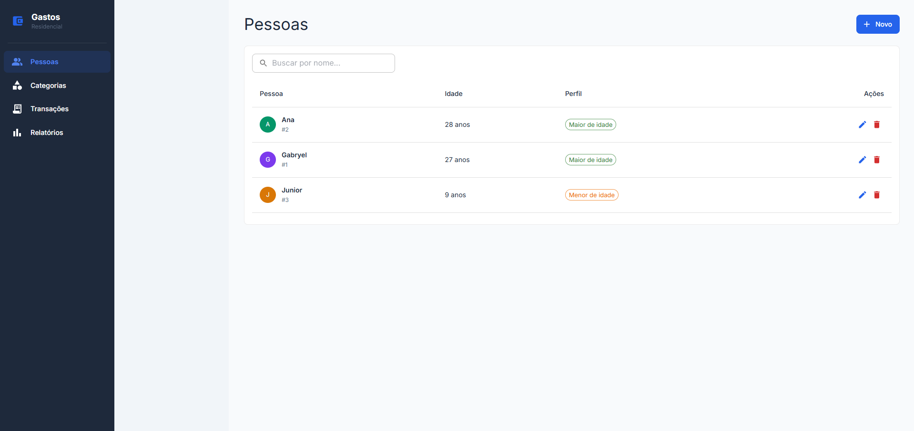
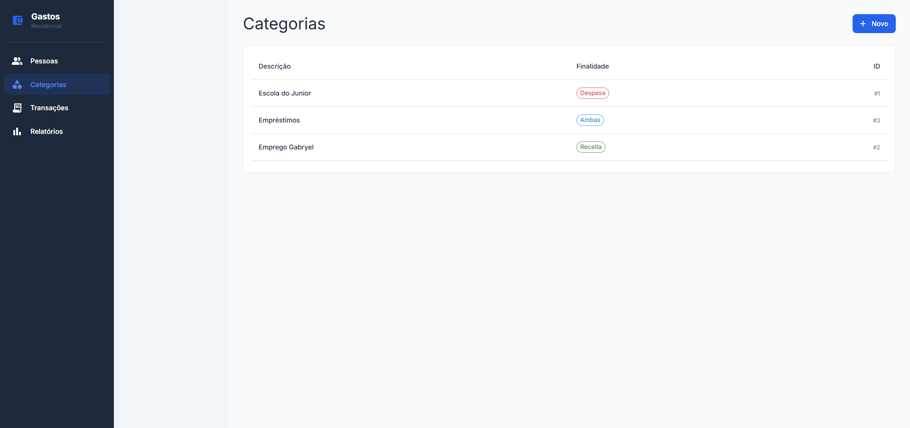
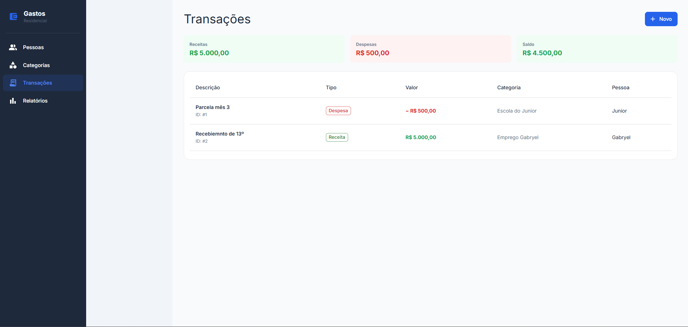
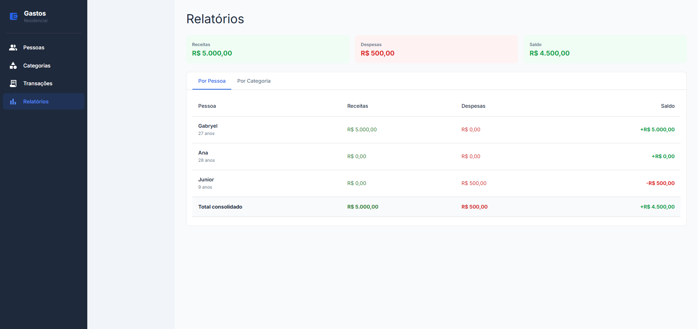

# Controle de Gastos Residenciais

Sistema para controle de finanças domésticas. Permite cadastrar pessoas, categorias e transações, além de consultar relatórios consolidados por pessoa e por categoria.

---

## Stack

#### Frontend

- Next.js 16
- TypeScript
- Material UI (Para não precisar fazer os componentes do zero)

#### Backend

- C# / .NET Core 10
- SQLite
- Scalar

---

## Pré-requisitos

Para garantir o funcionamento correto do ecossistema, certifique-se de ter instalado:

- Node.js 20+ [https://nodejs.org/en/download/current]
- .Net Core 10 Runtime [https://dotnet.microsoft.com/en-us/download/dotnet/10.0]

---

## Configuração e Execução

O projeto utiliza um sistema de Alocação Dinâmica de Portas. O Backend atua como o orquestrador da configuração.

#### 1. Iniciando o Backend

Ao executar o Backend pela primeira vez, ele verificará a disponibilidade de portas (iniciando em 3001) e criará automaticamente um arquivo .env na raiz do projeto.

```bash
cd backend
dotnet run
```

#### 2. Sincronização de Portas (.env)

O arquivo .env gerado será compartilhado pelas camadas da aplicação:

- NEXT_PUBLIC_BACKEND_PORT: Porta onde a API está rodando (padrão: 3001).

- NEXT_PUBLIC_FRONTEND_PORT: Porta permitida no CORS (padrão: 3000).

#### 3. Iniciando o Frontend

Com o Backend rodando e o .env gerado, inicie o Next.js:

```bash
cd frontend
npm install

# Para executar o projeto em ambiente de desenvolviemento
npm run dev

# Para executar o projeto em ambiente de produção
npm run build
npm run start
```

## Documentação da API

A API utiliza o Scalar para documentação autogerada. Para acessar a documentação:

1. Certifique-se de que o Backend está em execução.
2. Acesse a URL base informada no terminal do backend, adicionando o sufixo /scalar/v1.

```
http://localhost:3001/scalar/v1
```

## Estrutura do frontend

```

src/
├── api/ # Arquivos relacionados às chamas da API
├── app/
│ ├── pessoas/ # Página "pessoas"
│ ├── categorias/ # Página "categorias"
│ ├── transacoes/ # Página "transações"
│ └── relatorios/ # Página "relatorios"
├── components/ # Componentes reutilizáveis (UI) organizados por domínio
├── hooks/ # Hooks criados para melhorar a legibilidade do código das paginas
├── theme/ # Configuração do tema do menu
└── types/ # Estruturas utilizadas na API

```

## Estrutura do Backend

```

backend/
├── Controllers/ # Endpoints da API (Pessoas, Categorias, Transações)
├── Data/ # Contexto do Entity Framework e Configuração do SQLite
├── DTOs/ # Objetos de Transferência de Dados
├── Models/ # Entidades do Banco de Dados
├── Services/ # Lógica de negócio e regras de cálculo/validação
└── Program.cs # Configuração de Injeção de Dependência, CORS e Portas

```

---

## Funcionalidades

#### Pessoas

- Criar, editar, excluir e listar pessoas
- Ao excluir uma pessoa, todas as transações vinculadas são removidas automaticamente



#### Categorias

- Criar e listar categorias
- Cada categoria tem uma **finalidade**: Despesa, Receita ou Ambas



#### Transações

- Registrar e listar transações (despesas e receitas)
- **Menores de 18 anos** só podem ter despesas registradas
- As categorias disponíveis são filtradas conforme o tipo da transação



#### Relatórios

- Totais de receitas, despesas e saldo por pessoa
- Totais de receitas, despesas e saldo por categoria
- Totais gerais consolidados no rodapé de cada tabela



---
